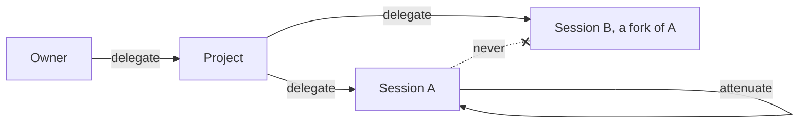

<BoundedContextDiagram name="Authority" />

## Principals and delegation

Authority flows down containment: the owner delegates to projects, a project to its sessions, and any holder may
narrow what it holds. Sessions never delegate to each other; that is why a fork gets its grants re-issued by the
project.

## Modes

| Mode | May do | Denies others | Sending | Used for |
|---|---|---|---|---|
| iso | read, write | read, write | moves | a session's worktree |
| val | read | write | copies | shared read-only resources |
| tag | invoke | nothing | copies | identity, credentials used by placeholder |

Turning iso into val ("freeze") happens in place, by the holder, as the [formal model](/docs/formal-model) found.

## Capability requests

"Allow once" mints a single-use capability, which is consumed by its first use; "allow for this session" mints a
capability held by the session.

<Lifecycle context="Authority" flow="CapabilityRequestLifecycle" />

<Tabs items={['Capability', 'CapabilityRequest']}>
  <Tab><Aggregate context="Authority" name="Capability" /></Tab>
  <Tab><Aggregate context="Authority" name="CapabilityRequest" /></Tab>
</Tabs>

## In CML

<include cwd lang="cml" meta='title="BoundedContext Authority"'>../domain/agent-hypervisor.cml#authority</include>
