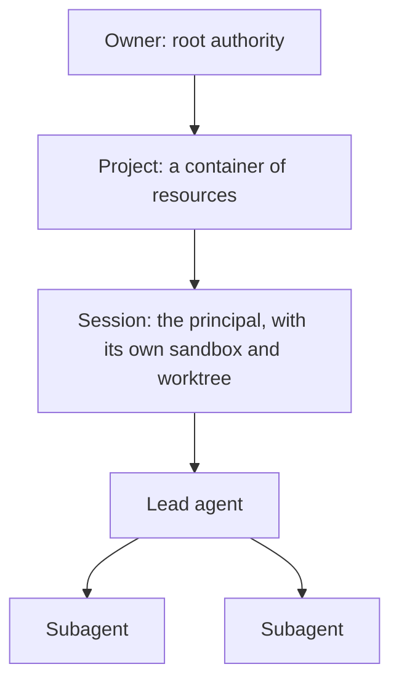

The model lives in [`domain/agent-hypervisor.cml`](https://github.com/phibkro/agent-hypervisor/blob/main/domain/agent-hypervisor.cml).
It was built bottom-up: what the owner and agents do (user stories), the nouns those stories use (subdomains), then
the lifecycles where the rules live (flows). Bounded contexts exist only where the language differs.

## Scope

One owner, many projects, one host for now (multi-host by design). A session is the unit of authority: it has one
lead agent that may spawn subagents, and one sandbox.

## User stories

<UseCases />

<Accordions>
  <Accordion title="The stories in CML">
    <include cwd lang="cml" meta='title="domain/agent-hypervisor.cml"'>../domain/agent-hypervisor.cml#stories</include>
  </Accordion>
</Accordions>

## Context map

Four bounded contexts. Authority is the shared language of permission, so the others conform to its terms;
isolation serves the sessions that agent work defines.

<ContextMap />

<include cwd lang="cml" meta='title="Context map"'>../domain/agent-hypervisor.cml#context-map</include>

| Context | Holds | Page |
|---|---|---|
| Agent work | Projects, sessions, turns, agents, worktrees, forks | [Agent work](/docs/domain/agent-work) |
| Authority | Capabilities (iso, val, tag), capability requests, revocation | [Authority](/docs/domain/authority) |
| Secrets | Secrets and the placeholders agents use instead | [Secrets](/docs/domain/secrets) |
| Isolation | Sandboxes on hosts; mounts and egress as the physical form of capabilities | [Isolation](/docs/domain/isolation) |

## Ubiquitous language

| Term | Meaning |
|---|---|
| Owner | The one user; holds root authority and answers every request |
| Project | A container of resources (repositories, host directories, secrets, endpoints) |
| Session | A unit of agent work, and the security principal; one sandbox, one worktree |
| Turn | One prompt and everything the agents did until they stopped; starts with a checkpoint |
| Agent | The lead or a subagent; acts for the session, never a principal |
| Capability | Authority over a resource: iso (exclusive), val (shared, immutable) or tag (identity only) |
| Capability request | An agent asking for authority it does not hold; granted once, for the session, or denied |
| Secret, placeholder | A credential the agent uses by placeholder; the real value is swapped in at egress |
| Sandbox | The microVM a session runs in; stops when idle, keeps nothing that matters |

## Subdomains

<Tabs items={['Agent work', 'Authority', 'Secrets', 'Isolation']}>
  <Tab><SubdomainDiagram name="AgentWork" /></Tab>
  <Tab><SubdomainDiagram name="Authority" /></Tab>
  <Tab><SubdomainDiagram name="Secrets" /></Tab>
  <Tab><SubdomainDiagram name="Isolation" /></Tab>
</Tabs>
