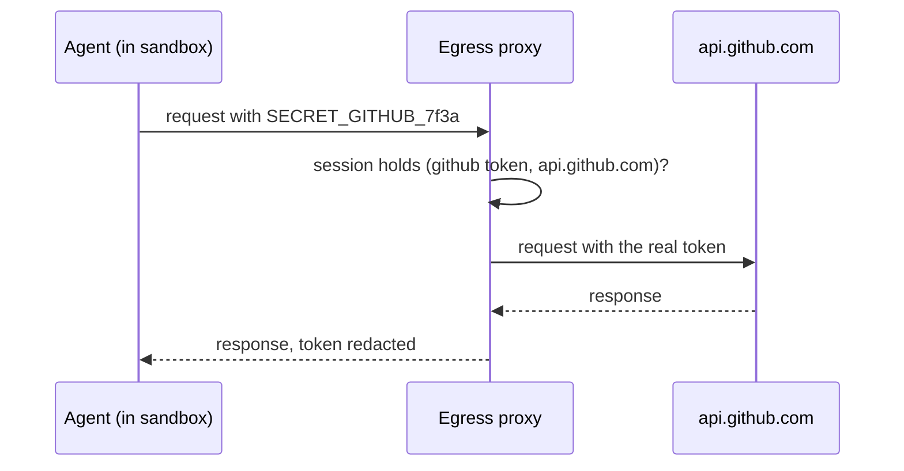

<BoundedContextDiagram name="Secrets" />

A secret is a reference into the owner's secret store, never the value. A session that holds a secret capability
sees a placeholder token; the egress proxy replaces it with the real value on requests to the destinations the
capability allows. The right is therefore a pair, a secret and a destination, which matches the HTTP scopes in
[capalg](/docs/capalg).

<Aggregate context="Secrets" name="Secret" />

## In CML

<include cwd lang="cml" meta='title="BoundedContext Secrets"'>../domain/agent-hypervisor.cml#secrets</include>
