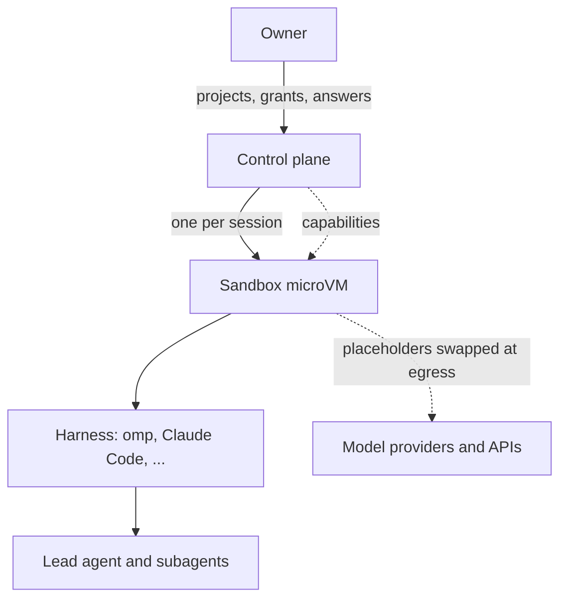

agent-hypervisor runs coding-agent harnesses (omp first; Claude Code, Codex and pi later) one session at a time,
lets you follow and answer them from any device over Tailscale, and gives each session exactly the authority its
task needs through an object-capability algebra. It is to agents what a hypervisor is to guests: it decides where
they run, what they can touch, and when they stop.

| Hypervisor | agent-hypervisor |
|---|---|
| Management plane | Control plane: sessions, approvals, questions |
| Guest VM | Sandbox, one per session |
| Guest kernel and runtime | Harness |
| Process | Agent (the lead and its subagents) |
| Grant tables, device passthrough | Capabilities, realised as mounts and egress rules |

## What is here

<Cards>
  <Card title="Domain model" href="/docs/domain" description="User stories, the context map and four bounded contexts, generated from Context Mapper." />
  <Card title="Formal model" href="/docs/formal-model" description="Alloy checks of the capability, mount and fork invariants, run on every build." />
  <Card title="Control plane prototype" href="/docs/prototype" description="The working web app: omp over ACP, approvals, questions, projects, import." />
  <Card title="capalg" href="/docs/capalg" description="The capability algebra in Rust." />
</Cards>

## A capability request, end to end

<GraphFlow
  title="ALLOW ONCE"
  rows={[
    { nodes: [{ label: 'agent needs a directory' }, { label: 'capability request' }, { label: 'owner, from any device', tone: 'accent' }] },
    { nodes: [{ label: 'single-use capability' }, { label: 'mount hot-plugged' }, { label: 'used once, consumed' }] },
  ]}
/>

## Status

<GraphCheck
  title="ROADMAP"
  items={[
    { label: 'Control plane prototype: omp over ACP, approvals, questions, projects, import', done: true },
    { label: 'Domain model in Context Mapper, invariants checked in Alloy', done: true },
    { label: 'Docs site generated from the models', done: true },
    { label: 'Fix what real omp exposed: cancel, unreachable models', done: false },
    { label: 'capalg as the grant store: requests, single-use, revocation', done: false },
    { label: 'Cloud Hypervisor sandbox on a Linux host', done: false },
    { label: 'Secrets through an egress proxy', done: false },
  ]}
/>

A prototype for one owner on one host. The control plane runs omp and has been exercised against real omp with a
small local model. Sandboxing (Cloud Hypervisor) needs a Linux host with KVM and is next, followed by secrets
through an egress proxy.

Every diagram on this site is generated at build time from the model files in the repository
(`domain/agent-hypervisor.cml`, `spec/capabilities.als`). A model that no longer validates, or an Alloy check
with an unexpected outcome, fails the build.
